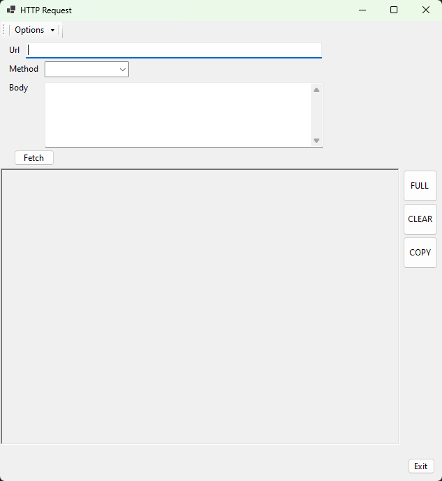

<!-- 
Copyright (c) 2024-2026 Robert A. Howell
Author: Robert A. Howell
Description: A Windows app, useful to developers or even security analysts. The app sends http request calls (i.e., GET, POST, PUT, etc.) using a built-up GUI.
Created_Date: August 2024
Edited: 2026-01-19
-->

# HttpRequest Repository  
This repository stores a windows application project (Desktop + .NET + C#). The public (instead of private) nature of this repository is to allow for a showcase of my development ability. It is not for software distribution. It is for exploring, reading, or learning from. To that extent, this repository will not include the future application's full source code. It is, however, a starting point.  

# Main  
The application, called HTTP Request, provides a GUI means of sending customized HTTP requests and displaying the response data in useful ways. It provides a close inspection of request and response data in server-based web environments. For developers or security analysis, this tool promotes testing, inspecting and improving your website's behavior.  

## License  
The use of this software and/or its code is licensed to robhowe-A's (account) owner [see below copyright].  

##  Where do I begin?  
1. Application installation is available in the Microsoft Store, [here](https://apps.microsoft.com/detail/9P1X1ZPKMTLN?hl=en-us&gl=US&ocid=pdpshare)
   > Note: The application is only released in the U.S.A. via the Microsoft Store. Global markets are excluded for tax collection purposes. Full functionality is available for purchase (it's priced at $11.49).
2. In the start menu, click "HTTP Request" to open the app
3. Complete the form and click "Send"
4. You're started!
   > Issues: Please inform online any issues you experience either via this [GitHub Issues](https://github.com/robhowe-A/WinHttpRequest/issues) (`https://github.com/robhowe-A/WinHttpRequest/issues`) page or the application's website at [www.httprequest.app](https://www.httprequest.app/index.php/2025/04/22/welcome-to-http-request/).

HTTP Request is a working tool, not designed as an attractive, refined display product. Styles are basic and default in many elements. Developed in Forms style, the app is useful with data in different sizes, large or small. Responsive (responsive applications expand or collapse or move elements to fit the window size) and dynamically adaptive view controls make it easy to read and sift data up to the 1920 x 1920 max dimensions.  

## How to use the application  
Enter any url and select a method for the request. The default is a GET request. Use the options or change the input parameters for your requests. Some functionality is for development purposes and may not function.  

## Privacy Policy  
This app does not collect PII data or any records to identify a purchaser individual. Collected information is anonymous and to be used for software improvement.  

## Security  
Part of web security with requests is the headers sent with the request. When POST requests are sent (along with the other requests adding a message body), a StringContent is made in the code for the request. This provides security and ensures the text added to the form is valid string characters to prevent malicious requests from being sent.  

--------  
&copy; 2024–2026, Robert H Developing. All rights reserved.  

#### Tags – (optional)Updates  

Version 1.3 - 1.5

9-28-2024: v1.3.3-alpha  
9-29-2024: v1.3.4-alpha - PATCH + DELETE added  
9-30-2024: v1.4.1-alpha - advanced requests  
9-30-2024: v1.4.2-alpha - advanced form sizing  
10-1-2024: v1.4.3-alpha - name-value key  
10-6-2024: v1.5.1-alpha - advanced details view  
10-6-2024: v1.5.2-alpha  
10-6-2024: v1.5.3-alpha

  

Version 1.6 - 1.8

10-13-2024: v1.6.1-alpha - performance measure  
10-19-2024: v1.6.2-alpha - "delete" menustrip  
10-19-2024: v1.6.3-alpha  
10-20-2024: v1.6.4-alpha - http version option functionality  
10-22-2024: v1.6.5-alpha - progress bar  
10-22-2024: v1.6.6-alpha - http/3  
11-18-2024: v1.6.7-alpha - embedded user agent  
12-16-2024: v1.7.1-alpha - link requests(via html head)  
12-17-2024: v1.7.2-alpha - html subsequents  
12-18-2024: v1.7.3-alpha - html css subsequent  
12-19-2024: v1.7.4-alpha - status code each tab  
12-21-2024: v1.7.5-alpha - status code advanced detail  
12-21-2024: v1.7.6-alpha - item detail adv view  
1-6-2025: v1.8.1-alpha - DELETE method request body  
1-6-2025: v1.8.2-alpha - adv window open bug fix  
1-7-2025: v1.8.3-alpha - clear + copy buttons for individual response tab  
1-8-2025: v1.8.4-alpha - adv buttons change visibility behavior  
1-8-2025: v1.8.5-alpha - adv button tag data change on exception

  

Version 1.9 - 2.1.1-alpha

1-12-2025: v1.8.6-alpha - Request address data detail  
1-12-2025: v1.8.7-alpha - Request address data detail full sizing  
1-13-2025: v1.8.8-alpha - Advanced option "Allow auto redirect"  
1-14-2025: v1.8.9-alpha - Advanced detail addition  
1-16-2025: v1.8.10-alpha - Content type header tool tip  
1-16-2025: v1.8.11-alpha - Data grid view row cleanup exception fix  
1-18-2025: v1.8.12-alpha - Content-Type header without request message body added  
1-24-2025: v1.9.1-alpha - XML indented print  
1-27-2025: v1.9.2-alpha - Remove adv view on request form change (allow redirect toggle)  
2-3-2025: v1.9.3-alpha - Duplicate Host header show error in data grid  
<strong>--AVAILABLE--</strong>4-30-2025: v1.9.4.0 - Microsoft store release  
2-14-2025: v2.0.0-alpha - .NET 9 desktop version (GUI ONLY... use v1 release for developed functions)  
2-14-2025: v2.0.1-alpha - Prevent app opening if login is not selected  
2-16-2025: v2.0.2-alpha - Styles and view function setup  
2-28-2025: v2.0.3-alpha - Form basic request functions implementation  
3-4-2025: v2.0.4-alpha - Advanced details form open  
3-5-2025: v2.0.5-alpha - Clear and copy basic functions  
3-6-2025: v2.0.6-alpha - Advanced details window text, data addition  
3-7-2025: v2.0.7-alpha - Advanced details additions  
3-8-2025: v2.0.8-alpha - Advanced details window size  
3-10-2025: v2.0.9-alpha - Server headers added to requests  
3-10-2025: v2.1.0-alpha - Advanced options addition  
3-19-2025: v2.1.1-alpha - Added request send status info + bug from WPF event fixed in redirect

**<u>CURRENT RELEASE:</u> HTTP Request v1.9.4.0** – Microsoft store release  
Publisher: Robert H Developing  
Developer: Robert Howell  
Purchase: [HTTP Request on Microsoft Store](https://apps.microsoft.com/detail/9p1x1zpkmtln?hl=en-us&gl=US&ocid=pdpshare)  
Learn: [www.httprequest.app](https://www.httprequest.app/)  
